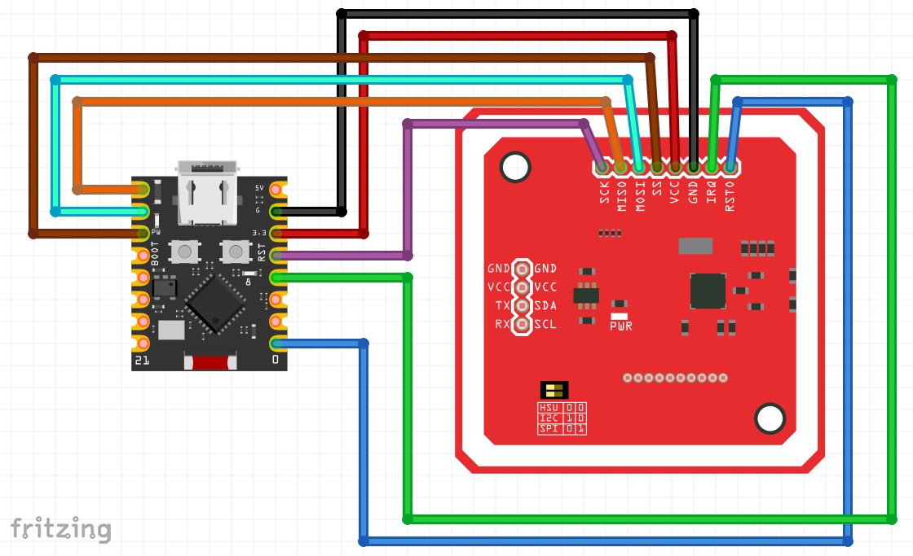
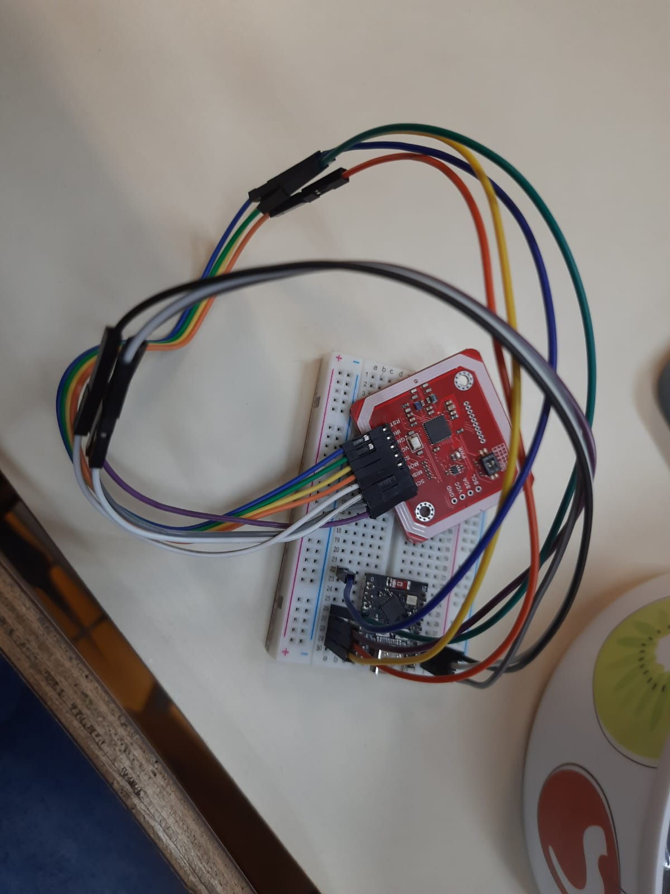

# CardForRPG

## Introdução

O projeto CardForRPG começou sem um objetivo muito claro. 

Ao decorrer do semestre, os membros do grupo decidiram explorar o uso de cartões e tags, o que os levou a utilizarem e obterem conhecimento dos seguintes dispositivos:
1. RC522, por meio da biblioteca disponível [aqui](https://www.dropbox.com/scl/fo/78n58kjtf8gh7hdtu57x0/AHEaacgBFEQvSOfT1gF8FS0/video%2012%20RFID/mfrc522.py?rlkey=cw5nzotjf5p7zw5olox9qovg4&e=1&st=o0f0epko&dl=0)

2. PN532, por meio da biblioteca disponível [aqui](https://github.com/Carglglz/NFC_PN532_SPI/blob/master/NFC_PN532.py), obs: essa biblioteca não realizava a escrita em todo o espaço dos cartões, por isso adicionaram a função [mifare_classic_write_block](PN532/PN532.py) para realizar essa tarefa

Ao final do semestre, decidiram criar um projeto usando o PN532 para ajudar na gestão de personagens de RPG.

## Componentes utilizados
- ESP32-C3 mini
- Jumpers
- PN532

## Explicação do código utilizado

No arquivo [boot.py](boot.py), há a configuração utilizada para conexão wifi do esp32, as variáveis globais dos dados do formulário utilizado para gerenciamento dos personagens e o código de leitura e de escrita do PN532.

No arquivo [main.py](main.py), há o formulário e a definição do servidor e o tratamento das requisições de escrita e leitura do cartão e de reinício das variáveis globais.

Primeiro, envie para o esp32, o arquivo [boot.py](boot.py) com as informações corretas de uma rede wifi, e depois envie o [main.py](main.py).

## Conclusão

 

O projeto entregue foi um MVP do que consideramos necessário para uma ficha de personagem do RPG Ordem Paranormal, ainda faltaram algumas partes como equipamentos/armas, habilidades (perícias e rituais).

Algumas informações para auxílio em possíveis futuras implementações estão disponíveis [aqui](Documentacoes
/Tabelas-Consulta)

## Comentários

Quem sabe se tivessemos tido a ideia antes, poderiamos ter feito mais :/

Acreditamos que é possível melhorar o algoritmo de leitura e de escrita do cartão para mais de um bloco por vez, no formato em que está, a comunicação SPI é reiniciada toda vez.

Acreditamos que é possível melhorar também o algoritmo de escrita, ele tem um comportamento que se a escrita não for feita com sucesso, o algoritmo já passa para a próxima entrada.

Nós acabamos não focando em interface, então talvez fazer uma melhor, seja interessante também

